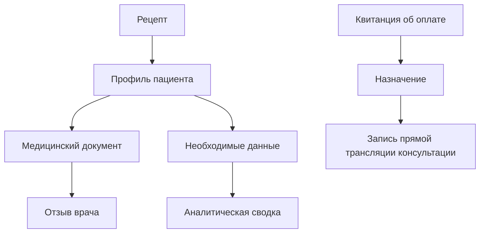
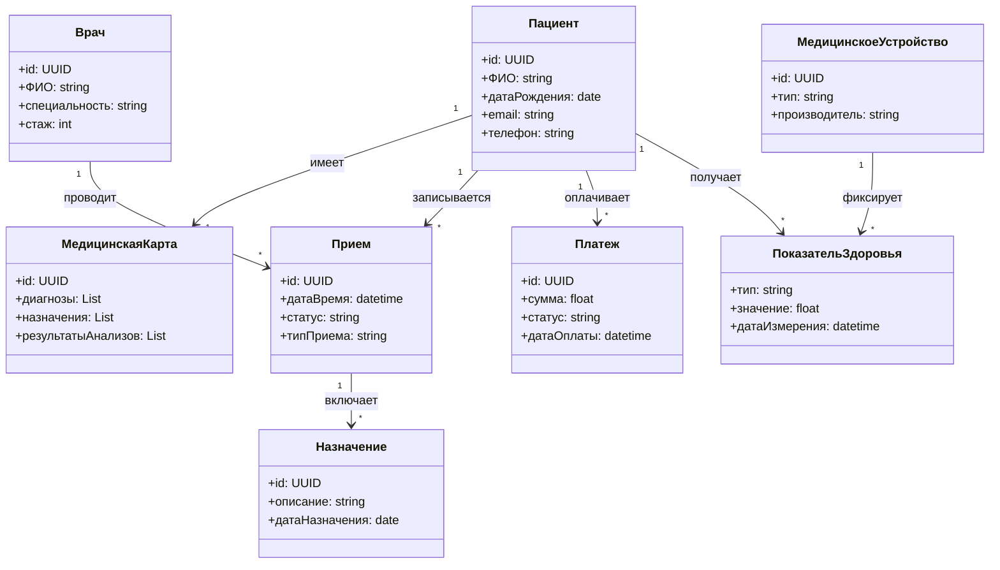
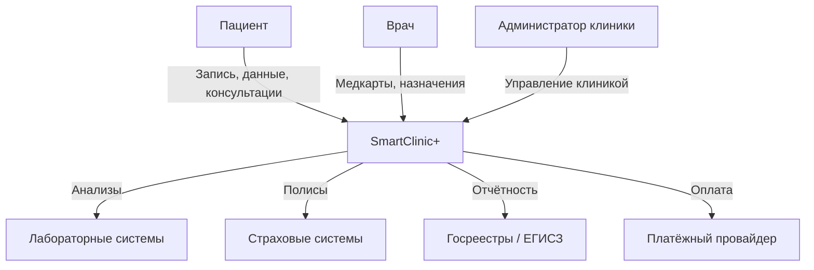
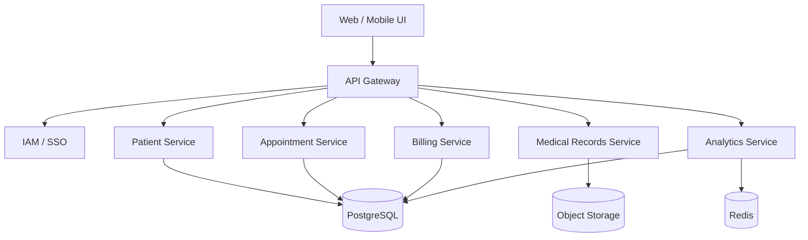
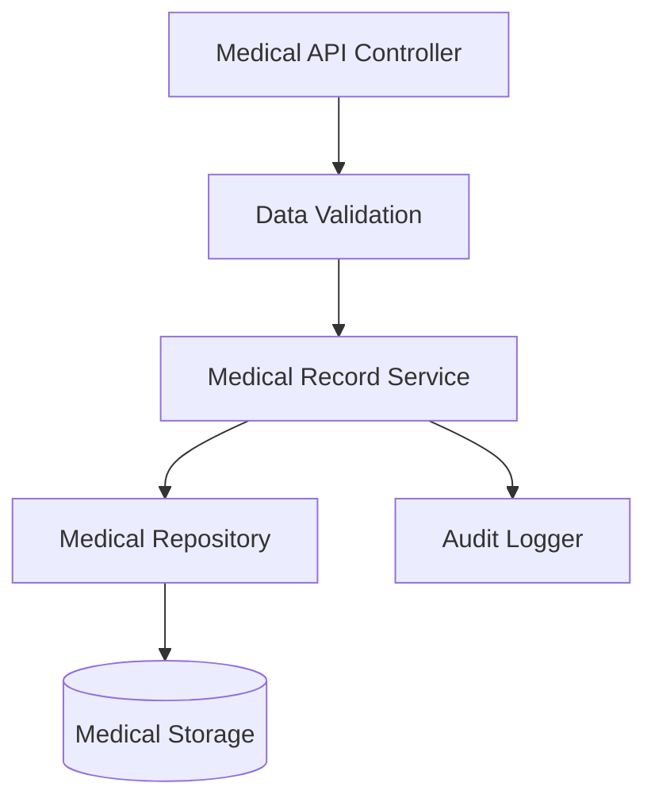
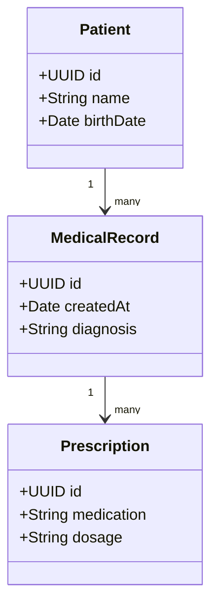

# КОНЦЕПЦИЯ СИСТЕМЫ “SmartClinic+”
### Цифровая экосистема для онлайн-медицины и мониторинга здоровья

## 1. Краткое резюме проекта

“SmartClinic+” — цифровая платформа дистанционной медицины, позволяющая пациентам проходить онлайн-консультации, получать электронные назначения, отправлять врачу данные с носимых устройств (пульс, давление, температура), хранить медицинские документы и получать уведомления о необходимости анализа или приёма лекарств.

Система объединяет: пациента, врача, клинику, лаборатории, страховые компании и интегрируется с ЕМИАС / ЕГИСЗ.

Цель — создать единый канал предоставления дистанционных медуслуг, повысить удобство и качество медицинского обслуживания.

## 2. Описание проблемы, цели, ограничений и приоритетных клиентских путей

### 2.1. Проблемы текущего состояния

- Фрагментация данных: информация о пациентах хранится в разных системах и базах данных, что затрудняет быстрый доступ и обработку данных в случае экстренной необходимости.
- Отсутствие единой системы для записи на прием: пациенты часто используют несколько каналов (телефон, онлайн-платформы, бумажные записи) для записи на прием к врачу, что создаёт путаницу и ошибки.
- Низкая автоматизация процессов: большинство операций, включая назначение лечения, запись на прием, выписку рецептов и анализы, выполняются вручную, что увеличивает время ожидания и вероятность ошибок.
- Отсутствие полноценной цифровой интеграции: взаимодействие между различными медицинскими учреждениями и специалистами затруднено, из-за чего затягиваются сроки диагностики и лечения.
- Проблемы с доступом к медицинской информации: пациенты не всегда могут получить актуальную информацию о своём здоровье, результаты анализов часто не могут быть переданы через безопасные каналы.

### 2.2. Цели концепции для "SmartClinic+":

- Обеспечить интеграцию всех сервисов медицинского учреждения — создание единой цифровой платформы для ведения всех медицинских данных, записи на приём, а также автоматизация процесса выставления диагнозов и назначения лечения.
- Повысить прозрачность и доступность данных для пациентов — внедрение интерфейса для пациента, через который он сможет отслеживать своё лечение, результаты анализов и получать актуальную информацию о состоянии здоровья.
- Оптимизировать рабочие процессы внутри медицинских учреждений — сокращение времени на бумажную работу, ведение медицинской карты пациента и обработку данных с помощью автоматизированных систем.
- Снизить нагрузку на врачей и административный персонал — автоматизация регистрации, назначения встреч и повторных анализов с использованием AI и автоматических уведомлений.
- Обеспечить надежность и безопасность хранения медицинских данных — соблюдение всех стандартов и законодательных норм по защите персональных данных пациента, включая использование защищённых каналов для передачи данных и их обработки.
- Создать единое цифровое пространство для врачей и медицинских учреждений — обмен медицинскими картами, анализами и историями болезней между учреждениями для более быстрой диагностики и оказания помощи.

### 2.3. Ограничения

- Необходимость соблюдения требований медицинских стандартов: система должна быть в полной мере согласована с российским законодательством в сфере здравоохранения, включая нормативы по защите персональных данных (например, ФЗ-152).
- Требования к защите персональных данных: важно гарантировать, что персональная информация пациента, а также все медицинские данные, будут храниться и передаваться в защищённом виде.
- Технические ограничения для интеграции с существующими системами: платформы других медицинских учреждений могут иметь устаревшие форматы данных или недостаточную совместимость с новыми решениями, что создаёт препятствия для интеграции.
- Ограничения в доступности интернет-сервисов: в некоторых регионах доступ к интернет-сервисам может быть ограничен, что затрудняет использование онлайн-платформ для записи на прием или доступа к результатам анализов.
- Необходимость в обучении персонала: переход на электронное управление требует дополнительного обучения врачей и администраторов клиник для эффективного использования новой системы.

### 2.4 Клиентский путь
| **Стадия пути**             | **Активности**                                                                | **Чувства**                   | **Опыт**                                      | **Ожидания**                                           |
| --------------------------- | ----------------------------------------------------------------------------- | ----------------------------- | --------------------------------------------- | ------------------------------------------------------ |
| **Осознание потребности**   | - Осознание проблемы со здоровьем                                             | Тревога, сомнение             | Переизбыток информации о медицинских услугах  | Быстро получить помощь и рекомендацию                  |
| **Первый вход и онбординг** | - Регистрация пациента в системе                                              | Неловкость, волнение          | Важность указания актуальных данных           | Простая и понятная регистрация без лишних шагов        |
| **Запрос рекомендации**     | - Запросить консультацию по болезни                                           | Неопределенность, любопытство | Получение рекомендации по симптомам           | Персонализированный ответ на основе симптомов          |
| **Запись на прием**         | - Выбор врача, даты и времени для записи                                      | Уверенность, удовлетворение   | Плавный процесс записи на прием               | Удобная и быстрая запись, без очередей                 |
| **Процедура/диагностика**   | - Прохождение диагностики, сдача анализов                                     | Тревога, надежда              | Комфорт в процессе, но напряжение от ожидания | Быстрые и точные результаты, минимум ожидания          |
| **Ожидание результатов**    | - Ожидание результатов анализов, диагностики, консультаций                    | Нетерпение, беспокойство      | Ожидание уведомлений                          | Быстрое уведомление о готовности результата            |
| **Получение результатов**   | - Получение заключения по лечению или диагнозу                                | Удовлетворение, уверенность   | Уведомление через приложение/сайт             | Точные и понятные результаты, рекомендации для лечения |
| **Продолжение лечения**     | - Применение назначения, продолжение лечения или записи для повторного приема | Спокойствие, уверенность      | Легкость в следующем шаге лечения             | Удобный интерфейс для контроля лечения и консультаций  |
| **Обратная связь**          | - Оценка полученной помощи, оставление отзыва о врачах и обслуживании         | Благодарность, удовлетворение | Легкость в оставлении отзыва                  | Удобный процесс для подачи отзывов                     |

### 2.5 RFM‑анализ и сегментация клиентских путей

| **Сегмент**    | **R (давность)** | **F (частота)** | **M (сумма/ценность)** | **Типовой путь**                                                                                       | **Индивидуальный подход**                                                                            |
| -------------- | ---------------- | --------------- | ---------------------- | ------------------------------------------------------------------------------------------------------ | ---------------------------------------------------------------------------------------------------- |
| **Новые**      | Низкая           | Низкая          | Низкая                 | Регистрация в системе → Первичное обследование → Ожидание результатов                                  | Предложение о скидке на первую консультацию, адаптивные предложения для новых пациентов              |
| **Регулярные** | Низкая           | Средняя/Высокая | Средняя                | Запись на прием → Получение результатов → Следующий визит через некоторое время                        | Персонализированные рекомендации, уведомления для записи на плановый осмотр                          |
| **VIP/Фанаты** | Низкая           | Высокая         | Высокая                | Частые визиты → Запись на специализированные приемы/услуги → Постоянный мониторинг состояния здоровья  | Ранний доступ к новым услугам, эксклюзивные предложения и персональные консультации                  |
| **Уходящие**   | Высокая          | Ранее Средняя   | Средняя                | Редкие визиты → Прекращение лечения или ухода → Рестарт при новом запросе или при возвращении пациента | Реактивация: мотивационные акции, предложения скидок, консультации по причине прекращения лечения    |
| **Редкие**     | Средняя/Высокая  | Низкая          | Низкая                 | Случайная запись на прием → Разовая консультация → Заключение о текущем состоянии здоровья             | Меньше действий, но с возможностью предложить пакеты разовых услуг или скидки для возврата пациентов |

## 3. Архитектура

### 3.1 Ключевые функции 

Регистрация через ЕСИА и внутренняя учётная запись

Онлайн-запись на приём (телемедицинская консультация)

Передача данных с носимых устройств (давление, пульс, сатурация)

Хранение и отправка медицинских документов (анализы, заключения)

Чат и видеоконсультации с врачом

Электронные назначения + напоминания

Аналитика для врача (графики, отклонения от нормы)

Оплата услуг

### 3.2. Программная архитектура 

Архитектура SmartClinic+ построена на микросервисном подходе с использованием базовых платформенных сервисов (идентификация, интеграция, логирование, мониторинг, уведомления). Такой подход обеспечивает масштабируемость, отказоустойчивость и возможность интеграции с внешними медицинскими системами и государственными реестрами.

| **Контейнер / сервис**                    | **Назначение**                                                        | **Технологическая реализация (пример)** | **Данные**                    |
| ----------------------------------------- | --------------------------------------------------------------------- | --------------------------------------- | ----------------------------- |
| **Web UI**                                | Личный кабинет пациента и врача, запись на приём, результаты анализов | SPA (React / Next.js)                   | Кэш сессии, настройки UI      |
| **Mobile App**                            | Доступ к услугам клиники с мобильных устройств                        | Flutter / React Native                  | Локальные настройки, токены   |
| **API Gateway (базовый сервис)**          | Единая точка входа, маршрутизация, лимиты, безопасность               | Kong / Nginx / Envoy                    | Трассировки, правила доступа  |
| **IAM / SSO (базовый сервис)**            | Аутентификация, авторизация, роли (пациент, врач, администратор)      | Keycloak / другой IdP                   | Учётные записи, токены        |
| **User Profile Service**                  | Профили пациентов и врачей, согласия, персональные данные             | Backend (Java / Kotlin / Go / Python)   | Профили, consent, роли        |
| **Appointment Service**                   | Запись на приём, расписание врачей, управление слотами                | REST API + бизнес-логика                | Приёмы, расписания            |
| **Medical Records Service**               | Электронная медицинская карта (ЭМК)                                   | Backend + стандарты HL7/FHIR            | Диагнозы, назначения, история |
| **Lab Results Service**                   | Загрузка и хранение результатов анализов                              | API + интеграции с лабораториями        | Анализы, показатели           |
| **Recommendation Service**                | Персональные рекомендации (осмотры, анализы, напоминания)             | FastAPI + ML runtime                    | Фичи, рекомендации            |
| **ML Pipeline (Batch)**                   | Обучение и обновление моделей (риск, профилактика)                    | Airflow / Prefect + MLflow              | Датасеты, модели              |
| **Event / Analytics Service**             | Сбор событий, RFM-анализ, отчёты                                      | Kafka + ClickHouse / OLAP               | События, сегменты             |
| **Vector Store**                          | Поиск похожих случаев и рекомендаций                                  | Qdrant / pgvector                       | Эмбеддинги медданных          |
| **Relational DB**                         | Основные транзакционные данные                                        | PostgreSQL                              | Пользователи, приёмы, записи  |
| **Cache**                                 | Кэширование данных и быстрых ответов                                  | Redis                                   | Сессии, кэш запросов          |
| **Object Storage (базовый сервис)**       | Хранение файлов (анализы, изображения, документы)                     | S3-совместимое хранилище                | PDF, изображения, файлы       |
| **Logging / Audit (базовый сервис)**      | Аудит действий, безопасность, соответствие требованиям                | ELK / OpenSearch                        | Логи, аудит событий           |
| **Monitoring (базовый сервис)**           | Наблюдаемость, алерты, контроль SLA                                   | Prometheus / Grafana                    | Метрики, трейсинг             |
| **Notification Service (базовый сервис)** | Уведомления пациентам и врачам                                        | Email / SMS / Push / мессенджеры        | Шаблоны, история              |

Ключевые особенности архитектуры SmartClinic+ :
- Разделение ролей: пациент, врач, администратор.
- Поддержка медицинских стандартов (FHIR / HL7) для совместимости.
- Безопасность и аудит — обязательные компоненты для соответствия требованиям законодательства.
- ML-модули используются для профилактики, персональных рекомендаций и повышения качества обслуживания.
- Готовность к интеграциям с лабораториями, страховыми и государственными системами.

Компонентная схема данных

Диаграмма классов

Диаграмма контекста (C4)

Диаграмма контейнеров

Диаграмма компонентов
Контейнер — Medical Records Service

Диаграмма кода
UML-уровень (пример классов медицинской карты)

## 4. Связность и интеграция

Платформа SmartClinic+ проектируется как интеграционный центр медицинской экосистемы и обеспечивает сквозную связность между пациентами, медицинскими организациями, врачами и внешними государственными и коммерческими системами.

### Ключевые направления интеграции:

Государственные системы здравоохранения:
- ЕГИСЗ — получение и передача медицинских данных (приёмы, диагнозы, назначения).
- Реестры медицинских работников — верификация врачей и лицензий.

Системы идентификации и аутентификации:
- ЕСИА — подтверждение личности пациента и врача.
- SSO для медицинских организаций и корпоративных пользователей.

Медицинское оборудование и носимые устройства:
- Интеграция с фитнес-трекерами, тонометрами, глюкометрами.
- Автоматическая загрузка показателей в электронную медицинскую карту пациента.

Финансовые и платёжные сервисы:
- Онлайн-оплата приёмов, анализов и подписок.
- Интеграция с фискальными сервисами и бухгалтерскими системами клиник.

Межсистемное взаимодействие:
- Использование API и событийной модели (event-driven) для обмена данными между сервисами.
- Поддержка асинхронных сценариев (уведомления, напоминания, результаты анализов).

## 5. Принципы проектирования

### Клиентоориентированность 

Все бизнес-процессы строятся вокруг жизненных ситуаций пользователя:
- «Записаться к врачу»
- «Получить консультацию»
- «Отследить состояние здоровья»
- «Получить назначение и рекомендации»

### Микросервисная архитектура
- Независимое развитие сервисов (запись, ЭМК, платежи, аналитика).
- Упрощение масштабирования и обновлений.
- Повышение отказоустойчивости системы.

### Повторное использование компонентов
- Общие сервисы: аутентификация, уведомления, платежи, аналитика.
- Унификация пользовательских сценариев для разных клиник.

### Масштабируемость и гибкость
- Поддержка роста количества пользователей, клиник и медицинских данных.
- Быстрая адаптация под изменения законодательства и медицинских стандартов.

### Технологическая независимость
- Возможность использования отечественного ПО и облачных решений.
- Минимизация зависимости от конкретных вендоров.

## 6. Информационная безопасность

Информационная безопасность SmartClinic+ рассматривается как критически важный аспект, учитывая чувствительность медицинских данных.

### Основные меры безопасности:
Защита персональных и медицинских данных:
- Соответствие требованиям ФЗ-152 и медицинских регламентов.
- Разделение данных по ролям (пациент, врач, администратор).

Аутентификация и авторизация:
- Вход через ЕСИА или корпоративные учетные записи.
- Многофакторная аутентификация для врачей и администраторов.

Шифрование данных:
- Шифрование данных «на хранении» и «в передаче».
- Использование защищённых каналов связи (TLS).

Аудит и журналирование:
- Логирование всех действий с медицинскими данными.
- Возможность проведения расследований и контроля доступа.

Безопасная разработка:
- Использование практик Secure SDLC.
- Регулярное тестирование на уязвимости и контроль обновлений.

## 7. Экономическая эффективность

Внедрение SmartClinic+ обеспечивает измеримый экономический эффект для всех участников экосистемы.

### Для медицинских организаций:

- Снижение административных затрат на запись, документооборот и отчётность (до 30–40%).
- Повышение загрузки врачей за счёт онлайн-записи и телемедицины.
- Сокращение количества неявок пациентов благодаря напоминаниям.

### Для пациентов:

- Экономия времени на запись и получение консультаций.
- Снижение количества повторных визитов за счёт цифровых рекомендаций.
- Повышение прозрачности стоимости медицинских услуг.

### Для системы здравоохранения в целом:

- Повышение качества медицинской статистики и аналитики.
- Возможность масштабирования решения на другие регионы и домены (реабилитация, профилактика, корпоративная медицина).
- Повторное использование цифровых компонентов без дублирования затрат.

### Финансирование и развитие платформы возможно за счёт:

- Подключения клиник по модели SaaS.
- Платных расширенных функций (аналитика, ИИ-рекомендации).
- Партнёрств с медицинскими и страховыми организациями.
